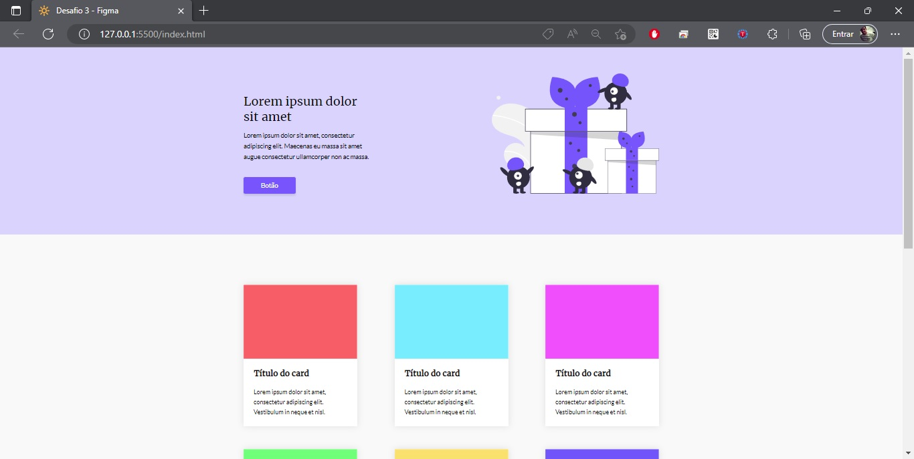

<h1 align="center"> Desafio 3 </h1>

  <a href="#-tecnologias">Tecnologias</a>&nbsp;&nbsp;&nbsp;|&nbsp;&nbsp;&nbsp;
  <a href="#-projeto">Projeto</a>&nbsp;&nbsp;&nbsp;|&nbsp;&nbsp;&nbsp;
  <a href="#-layout">Layout</a>&nbsp;&nbsp;&nbsp;|&nbsp;&nbsp;&nbsp;

 

  

## 🚀 Tecnologias

Esse projeto foi desenvolvido com as seguintes tecnologias:

- HTML
- CSS
- JavaScript

## 💻 Projeto

Nesse terceiro desafio foi possível praticar um pouco de html dinâmico com Javascript e também criar um formulário ao final da página.

## 🔖 Layout

Você pode visualizar o layout do projeto através [DESSE LINK](https://www.figma.com/file/Yb9IBH56g7T1hdIyZ3BMNO/Desafios---Codel%C3%A2ndia?node-id=3743%3A36&t=EocZqpnpFdkN9mfi-0). É necessário ter conta no [Figma](https://figma.com) para acessá-lo.

Projeto desenvolvido por mim [Mário Duarte](<https://www.linkedin.com/in/mario-duarte-3923431b8>) e design feito por [Iuri Silva](https://www.linkedin.com/in/iuricode).

